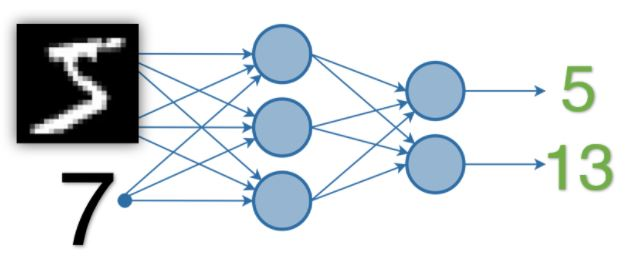
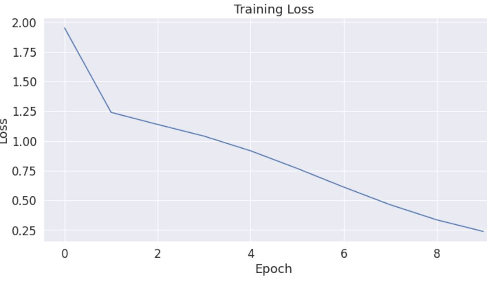

## EVA 6

### Assignment 3 - PyTorch

MNIST digit and Random digit Sum

#### Dataset:
Created a custom dataset using MNIST dataset and Random digit [0-9] and generates data tuple in format: 
(MNIST Image, MNIST Label, One hot encoded Random Digit, Sum of random digit and MNIST digit)

Also, transform the data to tensor and normalize the images with mean and standard deviation of train MNIST images.

#### Model
- Using convolution and transition blocks, One hot encoded random number is concatenated with the MNIST image and trained to predict the sum.
- Model Layers:
    Net(
      (conv1): Conv2d(1, 32, kernel_size=(3, 3), stride=(1, 1), padding=(1, 1))
      (conv2): Conv2d(32, 64, kernel_size=(3, 3), stride=(1, 1), padding=(1, 1))
      (pool1): MaxPool2d(kernel_size=2, stride=2, padding=0, dilation=1, ceil_mode=False)
      (conv3): Conv2d(64, 128, kernel_size=(3, 3), stride=(1, 1), padding=(1, 1))
      (conv4): Conv2d(128, 256, kernel_size=(3, 3), stride=(1, 1), padding=(1, 1))
      (pool2): MaxPool2d(kernel_size=2, stride=2, padding=0, dilation=1, ceil_mode=False)
      (conv5): Conv2d(256, 256, kernel_size=(3, 3), stride=(1, 1))
      (conv6): Conv2d(256, 512, kernel_size=(3, 3), stride=(1, 1))
      (conv7): Conv2d(512, 10, kernel_size=(3, 3), stride=(1, 1))
      (fc1): Linear(in_features=20, out_features=128, bias=True)
      (fc2): Linear(in_features=128, out_features=19, bias=True)
    )

#### Number of parameters
The model has 2,209,309 trainable parameters

#### Loss Function
For predicting the sum of MNIST classification and random number, model uses Negative Log-Likelihood Loss Function. NLL uses a negative indication since the probabilities (or likelihoods) vary between zero and one, and the logarithms of values in this range are negative. In the end, the loss value becomes positive. 
This loss takes into account  the correct prediction with smaller probabilities and also supports prediction with higher probabilities.

#### Training Log
Epoch 1 : 
Train set: Average loss: 1.3325, Total MNIST Correct: 39040, Total Sum correct: 6212

Epoch 2 : 
Train set: Average loss: 1.1670, Total MNIST Correct: 57675, Total Sum correct: 9732

Epoch 3 : 
Train set: Average loss: 1.1285, Total MNIST Correct: 58730, Total Sum correct: 15928

Epoch 4 : 
Train set: Average loss: 0.9991, Total MNIST Correct: 59090, Total Sum correct: 24950

Epoch 5 : 
Train set: Average loss: 0.8109, Total MNIST Correct: 59286, Total Sum correct: 35291

Epoch 6 : 
Train set: Average loss: 0.7275, Total MNIST Correct: 59414, Total Sum correct: 45081

Epoch 7 : 
Train set: Average loss: 0.5712, Total MNIST Correct: 59489, Total Sum correct: 53196

Epoch 8 : 
Train set: Average loss: 0.4247, Total MNIST Correct: 59581, Total Sum correct: 57117

Epoch 9 : 
Train set: Average loss: 0.3327, Total MNIST Correct: 59647, Total Sum correct: 58794

Epoch 10 : 
Train set: Average loss: 0.1851, Total MNIST Correct: 59709, Total Sum correct: 59371

#### Train Loss curve

#### Testing Log
Test set: Average loss: 0.210, Digit Accuracy:99.23, Sum Accuracy:98.88
