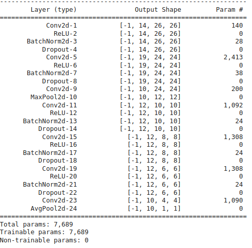

<h1 align = "center">Code Drill</h1>

<h2 align = "center">Assignment</h2>

1. Your target is: (over MNIST Data set)
   1. 99.4% (this must be consistently shown in your last few epochs, and not a one-time achievement)
   2. Less than or equal to 15 Epochs
   3. Less than 10000 Parameters (additional points for doing this in less than 8000 pts)
2. Do this in exactly 4 steps
3. Each File must have "target, result, analysis" TEXT block (either at the start or the end)
4. You must convince why have you decided that your target should be what you have decided it to be, and your analysis MUST be correct. 
5. Evaluation is highly subjective, and if you target anything out of the order, marks will be deducted. 
6. Explain your 4 steps using these target, results, and analysis with links to your GitHub files (Colab files moved to GitHub).
7. Keep Receptive field calculations handy for each of your models. 

---

<h2 align = "center">Solution and Results</h2>

Here we aimed to reach at 99.4% accuracy in less than 15 epochs under 8 K parameters (One should always aim big). To do so we divided the problem in 4 versions, where each version gets better and better.

### Step 1:

This version was designed to develop a basic structure of the final model, here the target was not to reach the benchmark given in the assignment, it was more on a decent architecture that gives decent accuracy. 

**Target:** Reach 99% accuracy in less than 20 K parameters

**Model Architecture:**

<div align="center">
  <center>
    
  </center>
</div>
**Receptive Field Calculations:**

| Layer | kernel | padding | stride | jin  | sin  | sout | RF   | jout |
| ----- | ------ | ------- | ------ | ---- | ---- | ---- | ---- | ---- |
| INPUT |        |         |        | 1    | 1    | 1    | 1    | 1    |
| Conv1 | 3      | 0       | 1      | 1    | 1    | 16   | 3    | 1    |
| Conv2 | 3      | 0       | 1      | 1    | 16   | 20   | 5    | 1    |
| Conv3 | 3      | 1       | 1      | 1    | 20   | 20   | 7    | 1    |
| MP    | 2      | 0       | 2      | 1    | 20   | 20   | 8    | 2    |
| Conv4 | 1      | 0       | 1      | 2    | 20   | 10   | 8    | 2    |
| Conv5 | 3      | 0       | 1      | 2    | 10   | 12   | 12   | 2    |
| Conv6 | 3      | 0       | 1      | 2    | 12   | 12   | 16   | 2    |
| Conv7 | 3      | 0       | 1      | 2    | 12   | 16   | 20   | 2    |
| Conv8 | 1      | 0       | 1      | 2    | 16   | 10   | 20   | 2    |
| Conv9 | 6      | 0       | 1      | 2    | 10   | 10   | 30   | 2    |

**Results:** 

    ```Train Accuracy : 99.90%```
    ``` Test Accuracy: 99.36% ```
    ```Total Parameters: 14,920```

<div align="center">
  <center>
    
  </center>
</div>

This Image represents the curve between the train/ test accuracy as loss. Here we can see that as we train more, the loss decreases and the accuracy increases. 

**Analysis:**

    1. Convolution Kernels:
        Here we used kernel of 3x3, because 
        1. they are accelerated by hardware, 
        2. they enables us to reach desired receptive field in less 
        parameters, 
        3. they help us attain axis of symmetry. 
    2. 1x1 Kernels: 
       1. Reduces Dimensions as filters out channel values
       2. Which intern reduces computational load
       3. Allows us to go deep
    3. Max Pooling:
       1. Gives more translation, Rotational and Scaling invariances as 
       compared to Comnvolution
       2. Doubles receptive field
       3. Faster computation as compared to Convolution layer
    4. Batch Normalization:
       1. Removed internal Covariate shift
       2. Faster Convergence

**Observation:**

1. The Model Architecture is little big as compared to Target parameters
2. Model nears the Benchmark Accuracy.
3. The Model over fits as we see the difference between train and test accuracy.

---

### Step 2:

Based on the observation in version 1, We decided to reduce the number of parameters try to get the target accuracy or at least an accuracy close to that.

**Target:** Reach regularise our model and remove heavy kernels.

<div align="center">
  <center>
    
  </center>
</div>
**Receptive Field Calculations:**

| Layer | kernel | padding | stride | jin  | sin  | sout | RF   | jout |
| ----- | ------ | ------- | ------ | ---- | ---- | ---- | ---- | ---- |
| INPUT |        |         |        | 1    | 1    | 1    | 1    | 1    |
| Conv1 | 3      | 0       | 1      | 1    | 1    | 16   | 3    | 1    |
| Conv2 | 3      | 0       | 1      | 1    | 16   | 20   | 5    | 1    |
| Conv3 | 3      | 1       | 1      | 1    | 20   | 20   | 7    | 1    |
| MP    | 2      | 0       | 2      | 1    | 20   | 10   | 8    | 2    |
| Conv4 | 1      | 0       | 1      | 2    | 10   | 10   | 8    | 2    |
| Conv5 | 3      | 0       | 1      | 2    | 10   | 12   | 12   | 2    |
| Conv6 | 3      | 0       | 1      | 2    | 12   | 12   | 16   | 2    |
| Conv7 | 3      | 0       | 1      | 2    | 12   | 16   | 20   | 2    |
| Conv8 | 1      | 0       | 1      | 2    | 16   | 10   | 20   | 2    |
| GAP   | 6      | 0       | 1      | 2    | 10   | 1    | 30   | 2    |

**Results:** 

    ```Train Accuracy : 99.24%```
    ``` Test Accuracy: 98.99% ```
    ```Total Parameters: 11,300```

<div align="center">
  <center>
    
  </center>
</div>

This Image represents the curve between the train/ test accuracy as loss. Here we can see that as we train more, the loss decreases and the accuracy increases. 

**Analysis:**

    1. Here we didnt alter anything much because here wanted to get the 
       same kind of output as we got in the pervious version
    2. Dropout Layer (0.15)
       1. Forces all the neurons to perform its best
       2. Works on Ensembling model
       3. Not sure where to put so we randomly keep it between layers.
    3. Global Average Pooling: 
       We have used GAP in the end because
        1.  It helps us in reducing the total trainable parameters as if 
        GAP wasnt there it could be a Conv layer or a dense layer
        2.  As the parameters are reduced, the chances of Over fitting 
        also reduced.
    4. Max Pooling is used at Receptive Field of 7x7 still.

**Observation:**

1. Model did not crosses the Benchmark Accuracy as the best test accuracy was 99.24%
3. The Model over fits a little in later epochs as we see the difference between train and test accuracy. (Not to worry over)

---

### Step 3:

Based on the observation in version 2, We decided to fix our model architecture to achieve the target accuracy.

**Target:** Try Reach 99.4% accuracy in less than 8 K parameters

<div align="center">
  <center>
    
  </center>
</div>
**Receptive Field Calculation:**

| Layer | kernel | padding | stride | jin  | sin  | sout | RF   | jout |
| ----- | ------ | ------- | ------ | ---- | ---- | ---- | ---- | ---- |
| INPUT |        |         |        | 1    | 1    | 1    | 1    | 1    |
| Conv1 | 3      | 0       | 1      | 1    | 1    | 14   | 3    | 1    |
| Conv2 | 3      | 0       | 1      | 1    | 14   | 19   | 5    | 1    |
| Conv3 | 1      | 0       | 1      | 1    | 19   | 10   | 5    | 1    |
| MP    | 2      | 0       | 2      | 1    | 10   | 10   | 6    | 2    |
| Conv4 | 3      | 0       | 1      | 2    | 10   | 12   | 10   | 2    |
| Conv5 | 3      | 0       | 1      | 2    | 12   | 12   | 14   | 2    |
| Conv6 | 3      | 0       | 1      | 2    | 12   | 12   | 18   | 2    |
| Conv7 | 3      | 0       | 1      | 2    | 12   | 10   | 22   | 2    |
| GAP   | 4      | 0       | 1      | 2    | 10   | 1    | 28   | 2    |

**Results:** 

    ```Train Accuracy : 99.26%```
    ``` Test Accuracy: 99.30% ```
    ```Total Parameters: 7,689```

<div align="center">
  <center>
    
  </center>
</div>

This Image represents the curve between the train/ test accuracy as loss. Here we can see that as we train more, the loss decreases and the accuracy increases.

**Analysis:**

    1. The model is not over-fitting at all.
    2. DropOut was not working as expected as we don't know which layer was causing over-fitting. Therefore adding to each layer with minimal amount (0.05 - 0.07).
    3. Seeing image samples, we can see that we can add slight augmentation.
    4. Closer analysis of MNIST can also reveal that just at RF of 5x5 we start to see patterns forming.Therefore we have used Maxpool at 5x5.

---

### Step 4:

Based on the observation in version 3, We  reduce the parameter to less than 8 K with maintaining the accuracy.

- **Model 1**

<div align="center">
  <center>
    
  </center>
</div>
**Receptive Field Calculation:**

| Layer | kernel | padding | stride | jin  | sin  | sout | RF   | jout |
| ----- | ------ | ------- | ------ | ---- | ---- | ---- | ---- | ---- |
| INPUT |        |         |        | 1    | 1    | 1    | 1    | 1    |
| Conv1 | 3      | 0       | 1      | 1    | 1    | 14   | 3    | 1    |
| Conv2 | 3      | 0       | 1      | 1    | 14   | 19   | 5    | 1    |
| Conv3 | 1      | 0       | 1      | 1    | 19   | 10   | 5    | 1    |
| MP    | 2      | 0       | 2      | 1    | 10   | 10   | 6    | 2    |
| Conv4 | 3      | 0       | 1      | 2    | 10   | 12   | 10   | 2    |
| Conv5 | 3      | 0       | 1      | 2    | 12   | 12   | 14   | 2    |
| Conv6 | 3      | 0       | 1      | 2    | 12   | 12   | 18   | 2    |
| Conv7 | 3      | 0       | 1      | 2    | 12   | 10   | 22   | 2    |
| GAP   | 4      | 0       | 1      | 2    | 10   | 1    | 28   | 2    |

**Results:** 

    Model 1: 
    ```Train Accuracy: 98.83%```
    ``` Test Accuracy: 99.48% ```
    ```Total Parameters: 7,689```

<div align="center">
  <center>
    
  </center>
</div>

- **Model 2**

<div align="center">
  <center>
    
  </center>
</div>

**Results:**


    Model 2: 
    ```Train Accuracy : 98.99%```
    ``` Test Accuracy: 99.53% ```
    ```Total Parameters: 7,550```

<div align="center">
  <center>
    
  </center>
</div>
This Image represents the curve between the train/ test accuracy as loss. Here we can see that as we train more, the loss decreases and the accuracy increases more gradually. 

**Analysis:**

    1. Here we reduced the parameters to fall in the total parameter range of less than 8k
    2. Stratergies followed:
       1. Dropout used is 0.05 and 0.07
       2. Image Augmentation enables the model to be robust
       - Random Rotation is use with range -7,7 with fill value
       - Translation (around 1.4 pixels)
       - Scaling (0.9, 1.1)
       - Contrast Jitter (0.04) 
       3. Very helpful in less dataset
    3. Step LR Scheduling (start from 0.05/0.07 with step = 5)
       1. Helps in faster convergence
       2. Helps in reaching close to global minima rather than getting stuck at local minima

**Observation:**

1. The Model Architecture has cleared our ultimate goal.

**Final Observations:**

We have observed that it is good to break down problem is smaller problems and then tackle it individually. Here we achieved our ultimate goal by first making a draft model to get a decent accuracy, then upgraded that model to perform similar in less than 10 k parameters, Then upgraded that model to cross 99.4% accuracy and then upgraded that model to attain that accuracy in less than 8K parameters As the problem increases we used more powerful tools like image augmentation, dropout and LR scheduling. We fine tuned them to get the best of out it. 
